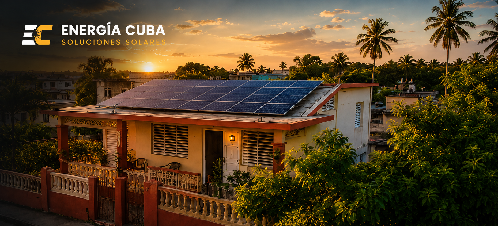
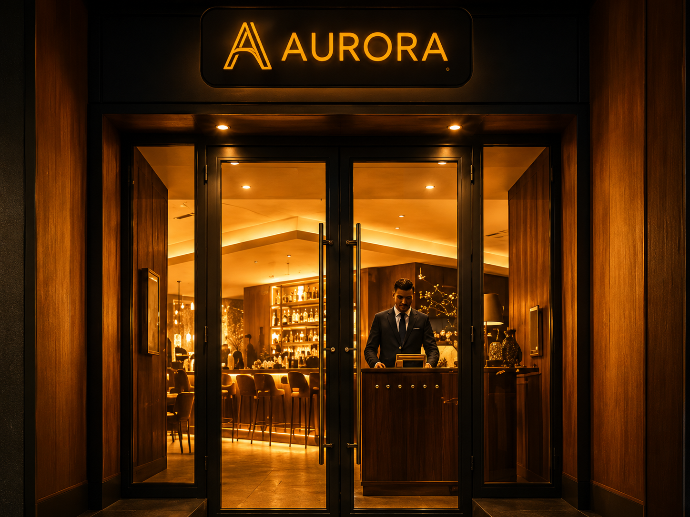

  

<h1 align="center">Hola, soy Raykel “RayRay” 👋</h1>

<h3 align="center">
  Ingeniero en Telecomunicaciones y Electrónica · Frontend/UI Engineer
</h3>

  Construyo interfaces web rápidas, claras y orientadas al diseño usando React, Next.js, TypeScript, motion y arquitectura frontend enfocada en producto.

  
  
  
  

---

## Qué construyo

<table>
  <tr>
    <td width="50%">
      <strong>Frontends de producto</strong> 
      Landing pages, portafolios, catálogos y frontends ecommerce construidos alrededor de claridad, velocidad y conversión.
    </td>
    <td width="50%">
      <strong>Ingeniería UI</strong> 
      Implementación de diseño a código, componentes reutilizables, sistemas responsive y arquitectura frontend mantenible.
    </td>
  </tr>
  <tr>
    <td width="50%">
      <strong>Motion e interacción</strong> 
      Uso GSAP, Framer Motion y efectos basados en scroll cuando ayudan a guiar la atención, aclarar estados o mejorar la percepción de calidad.
    </td>
    <td width="50%">
      <strong>Flujos comerciales</strong> 
      Checkouts, embudos de WhatsApp, integraciones de pago, actualizaciones en tiempo real y demos desplegables.
    </td>
  </tr>
</table>

---

## Stack principal

### Frontend

### UI / Motion / 3D

### Estado / Datos / Comercio / Deploy

---

## Trabajos destacados

  Interfaces web orientadas a claridad comercial, experiencia visual y conversión real.

<table>
  <tr>
    <td colspan="2" width="100%">
      
      <h3>Renovables Cuba</h3>
      

        Catálogo de productos solares y energía de respaldo con precios multidivisa,
        navegación clara, carrito, búsqueda, categorías y flujo de checkout por WhatsApp.
      

      

        <strong>Stack:</strong> React · Vite · TypeScript · UI de catálogo · Checkout por WhatsApp
      

      

        <a href="https://renovables-cuba-frontend.vercel.app/">Demo en vivo</a>
      

    </td>
  </tr>
  <tr>
    <td width="50%" valign="top">
      
      <h3>Arca Ilary</h3>
      

        Sitio bilingüe premium para catering cubano con narrativa visual,
        SEO estructurado y embudo de pedido por WhatsApp con contexto completo.
      

      

        <strong>Stack:</strong> React · Vite · i18next · JSON-LD · Embudo de WhatsApp
      

      

        <a href="https://catering-landing-sigma.vercel.app/">Demo en vivo</a>
      

    </td>
    <td width="50%" valign="top">
      
      <h3>Ritmo Habana</h3>
      

        Landing page comunitaria construida alrededor de horarios claros,
        precios, secciones responsive y contenido basado en datos.
      

      

        <strong>Stack:</strong> React · Vite · TypeScript · Tailwind · shadcn/ui
      

      

        <a href="https://ritmo-habana.vercel.app/">Demo en vivo</a>
      

    </td>
  </tr>
  <tr>
    <td width="50%" valign="top">
      
      <h3>Aurora</h3>
      

        Experiencia inmersiva para restaurante con storytelling visual,
        scroll fluido, navegación atmosférica y motion guiado por UX.
      

      

        <strong>Stack:</strong> Next.js · React · GSAP · Lenis · Tailwind
      

      

        <a href="https://aurora-restaurante.vercel.app/">Demo en vivo</a>
      

    </td>
    <td width="50%" valign="top">
      
      <h3>Kuro Atelier</h3>
      

        Portafolio 3D para una marca creativa usando WebGL como diferenciador
        visual sin sacrificar claridad de navegación.
      

      

        <strong>Stack:</strong> React · Vite · Three.js · React Three Fiber · Framer Motion
      

      

        <a href="https://landing-tattoo.vercel.app/">Demo en vivo</a>
      

    </td>
  </tr>
</table>

---

## Criterio de ingeniería

- Una buena interfaz explica la oferta antes de intentar impresionar.
- El motion debe guiar la atención, aclarar estados o mejorar el flujo. Si solo añade ruido, debe eliminarse.
- Frontend no es solo estilizar: incluye arquitectura de información, estado, accesibilidad, rendimiento y mantenibilidad.
- Prefiero sistemas pequeños y claros: datos tipados, componentes reutilizables, layouts predecibles y demos desplegables.
- No uso un stack para inflar un perfil. Uso la herramienta que encaja con el producto.

---

## Perfil técnico

Soy Ingeniero en Telecomunicaciones y Electrónica, basado en La Habana, Cuba.

Esa formación define cómo abordo el trabajo frontend: pensamiento sistémico, relación señal-ruido, fiabilidad, rendimiento y estructura técnica clara.

Actualmente estoy enfocado en:

- Frontend/UI Engineering
- Interfaces de producto
- Landing pages y portafolios
- Frontends ecommerce
- Experiencias web impulsadas por motion
- Implementación de diseño a código

---

## GitHub Stats

  
  

---

## Contacto

- GitHub: [RayRay-v0](https://github.com/RayRay-v0)
- Equipo: **MaRaBana-Tec**
- Ubicación: La Habana, Cuba
- Disponible para trabajo remoto freelance y part-time en Frontend/UI con alcance definido.
