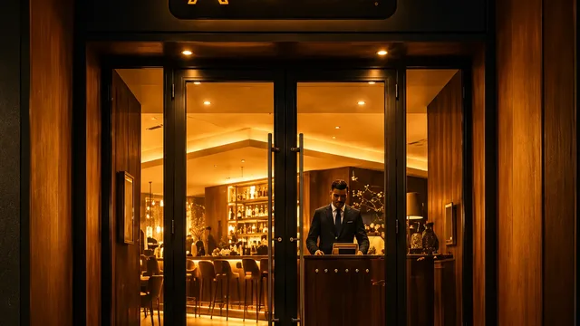

  

<h1 align="center">Hola, soy Raykel “RayRay” 👋</h1>

<h3 align="center">
  Ingeniero en Telecomunicaciones y Electrónica · Frontend/UI Engineer
</h3>

  Construyo interfaces web rápidas, claras y bien diseñadas con React, Next.js, TypeScript y motion cuando aporta al producto.

  
  
  
  

---

## Qué construyo

<table>
  <tr>
    <td width="50%">
      <strong>Frontends de producto</strong> 
      Landing pages, portafolios, catálogos y frontends ecommerce pensados para explicar bien una oferta y facilitar la acción del usuario.
    </td>
    <td width="50%">
      <strong>Ingeniería UI</strong> 
      Paso diseños a interfaces funcionales con componentes reutilizables, layouts responsive y una estructura frontend fácil de mantener.
    </td>
  </tr>
  <tr>
    <td width="50%">
      <strong>Motion e interacción</strong> 
      Uso GSAP, Framer Motion y efectos de scroll cuando ayudan a orientar al usuario, marcar estados o mejorar la navegación.
    </td>
    <td width="50%">
      <strong>Flujos comerciales</strong> 
      Checkouts, embudos de WhatsApp, integraciones de pago, actualizaciones en tiempo real y demos desplegadas para validar el producto.
    </td>
  </tr>
</table>

---

## Stack principal

### Frontend

### UI / Motion / 3D

### Estado / Datos / Comercio / Deploy

---

## Trabajos destacados

  Proyectos web construidos para usuarios reales, clientes y flujos de negocio concretos.

<table>
<tr>
<td colspan="2" width="100%" valign="top" align="left">

<strong>Renovables Cuba</strong>

Catálogo de productos solares y energía de respaldo con precios multidivisa, navegación por equipos y checkout por WhatsApp.

<strong>React</strong> · <strong>Vite</strong> · <strong>TypeScript</strong> · UI de catálogo · Checkout por WhatsApp

<a href="https://renovables-cuba-frontend.vercel.app/">Demo en vivo ↗</a>

</td>
</tr>
<tr>
<td width="50%" valign="top">

<strong>Arca Ilary</strong>

Sitio bilingüe para catering, con SEO estructurado y un flujo de cotización que lleva el pedido a WhatsApp.

React · Vite · i18next · JSON-LD

<a href="https://catering-landing-sigma.vercel.app/">Demo en vivo ↗</a>

</td>
<td width="50%" valign="top">

<strong>Ritmo Habana</strong>

Landing para clases de salsa con horarios, precios, secciones responsive y contenido organizado desde datos.

React · Vite · TypeScript · Tailwind

<a href="https://ritmo-habana.vercel.app/">Demo en vivo ↗</a>

</td>
</tr>
<tr>
<td width="50%" valign="top">

<strong>Aurora</strong>

Experiencia para restaurante con narrativa visual, scroll fluido y animaciones pensadas para acompañar la navegación.

Next.js · React · GSAP · Lenis · Tailwind

<a href="https://aurora-restaurante.vercel.app/">Demo en vivo ↗</a>

</td>
<td width="50%" valign="top">

<strong>Kuro Atelier</strong>

Portafolio 3D para un estudio creativo, con WebGL, estética oscura y navegación simple.

React · Vite · Three.js · R3F · Framer Motion

<a href="https://landing-tattoo.vercel.app/">Demo en vivo ↗</a>

</td>
</tr>
</table>

---

## Criterio de ingeniería

- Una buena interfaz debe explicar la oferta antes de intentar impresionar.
- El motion tiene que ayudar a entender, navegar o decidir. Si solo añade ruido, sobra.
- Frontend no es solo estilizar: también es arquitectura de información, estado, accesibilidad, rendimiento y mantenibilidad.
- Prefiero sistemas pequeños y claros: datos tipados, componentes reutilizables, layouts predecibles y demos desplegables.
- El stack se elige por el problema, no por lo bien que se ve en una lista.

---

## Perfil técnico

Soy Ingeniero en Telecomunicaciones y Electrónica, basado en La Habana, Cuba.

Esa formación influye en cómo trabajo frontend: estructura, criterio técnico, relación señal-ruido, rendimiento y atención a los detalles.

Actualmente estoy enfocado en:

- Frontend/UI Engineering
- Interfaces de producto
- Landing pages y portafolios
- Frontends ecommerce
- Experiencias web impulsadas por motion
- Implementación de diseño a código

---

## Actividad en GitHub

  
  

  El código público acompaña demos desplegadas, frontends de producto y experimentos visuales enfocados en UI, motion y claridad comercial.

---

## Contacto

- GitHub: [RayRay-v0](https://github.com/RayRay-v0)
- Equipo: **MaRaBana-Tec**
- Ubicación: La Habana, Cuba
- Disponible para proyectos remotos freelance y part-time en Frontend/UI con alcance definido.
